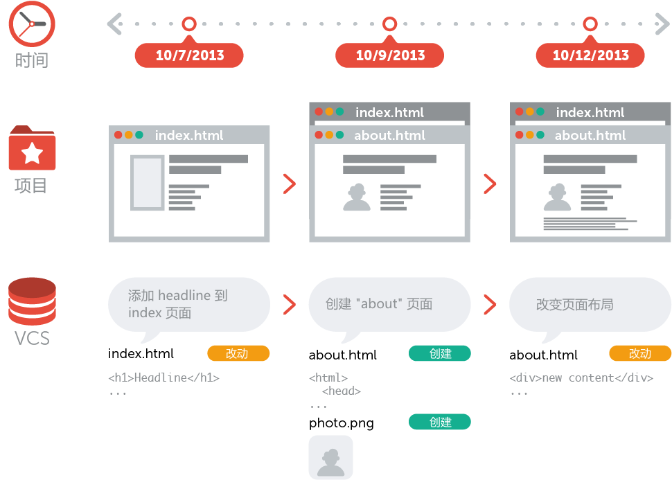

# 什么是版本控制

> 你可以把一个版本控制系统 `缩写VCS` 理解为一个 数据库 在需要的时候 它可以帮你完整地保存一个项目的快照 当你需要查看一个之前的快照 `称之为 版本` 时 版本控制系统可以显示出当前版本与上一个版本之间的所有改动的细节

版本控制与项目的种类 使用的技术和基础框架并无关系

 - 无论是设计开发一个HTML网站或者是一个苹果应用 它的工作原理都是一样的

 - 你可以选择任何你喜欢的工具来工作 它并不关心你用什么样的文本编辑器 绘图程序 文件管理器或其他工具

因此不要混淆版本控制的备份系统和一般的部署系统 当你开始尝试在你的项目中使用版本控制 你不需要替换和改变开发过程中使用的那些常用工具

版本控制系统会记录所有对项目文件的更改 这就是版本控制 听起来很简单

## 为什么要使用版本控制系统

在开发项目中使用版本控制系统有很多好处 接下来为你一一介绍

## 协同合作

试想一下 如果没有版本控制系统 当你需要处理那些共享文件夹中的文件时 你必须告知办公室里的所有人 你正在对哪些文件进行编辑 与此同时 其他人必须要避免与操作相同的文件 这是一个不现实和完全错误的流程 当你花了很长时间完成你的编辑后 可能这些文件早已经被团队里的其他开发成员修改或者删除了

如果使用了版本控制系统 每一个团队成员都可以在任何时间对任何文件毫无顾虑的进行修改 版本控制系统可以把之后所有的改动合并成一个共同的版本 不论是一个文件还是整个项目 这个共同的中心平台就是我们的版本控制系统

使用版本控制还有更多优点 这就要取决于你自己或者你的开发团队了

## 版本存储（正确地）

经常性地保存项目的改动是一个非常重要的习惯 但是如果没有版本控制系统这个操作将是非常困难的 并且非常容易出错的

- 你到底改动了什么 仅仅是针对一些特定文件的改动还是整个项目 首先你必须及时并小心地审查整个项目的每一个可能的改动细节 然后你需要付出大量且并不必要的时间来整理它

- 你如何命名这些版本 如果你是一个思维很有条理的人 你也许会定义一个比较容易理解的通用命名规则 比如这样 `acme-inc-redesign-2013-11-12-v23` 然而一旦涉及到一个多样性的改变 比如 在一次版本改动中 一些改动了标题区而另一些却没有被改动它 仅仅通过名字是很难追踪和判断这些改动的
- 最重要的问题可能就是你如何知道在第一个版本和第二个版本之间到底进行了哪些改动 只有很少人会真正地去花时间来仔细记录和观察每一个重要的变化 例如在项目文件夹的每一个README文件

每一个版本控制系统仅仅对应一个项目 因此 在你的本地只存在一个版本 那就是这个项目的当前工作版本 除此之外 而其它所有之前的版本和改动都已经被有序地存储在版本控制系统中了 当你需要时 你可以随时来查看之前的任何一个版本 而且还可以得到整个项目的快照

## 恢复之前的版本

要把一些文件恢复到上次改动之前的版本`甚至整个项目恢复到之前的版本` 这可能意味着你发现了一些严重的问题 如果你确定那些改动是错误的或者是没有必要的 那轻松的点几下你就可以简单地撤销它 在项目的每一个重要阶段 认识和正确地使用撤销这个功能会让你的工作变得非常轻松

## 了解发生了什么

每当你提交一次对项目新的改动时 你的版本管理系统会要求你添加一个对这次改动的简短描述 除此之外`如果是一个代码或者文本文件` 你还可以看到一个改动前和改动后的内容的详细对照 这样也可以帮助你很好地了解版本与版本之间的发展关系

## 备份
备份是一个分布式版本控制系统提供的非常好的附带功能 每一个团队成员都会在他的本地有一个完整的项目副本 包括整个项目的历史记录 如果你所依赖的服务器宕机了 或者是你的存储硬盘坏 所有你需要的恢复文件都可以在另外的团队成员的 Git 本地仓库中得到

##  什么是 Git

Git 是一个开源的分布式版本控制系统 用于敏捷高效地处理任何或小或大的项目

Git 是 Linus Torvalds 为了帮助管理 Linux 内核开发而开发的一个开放源码的版本控制软件

Git 与常用的版本控制工具 CVS  Subversion 等不同 它采用了分布式版本库的方式 不必服务器端软件支持

## Git 与 SVN 区别

Git 不仅仅是个版本控制系统 它也是个内容管理系统(CMS) 工作管理系统等

如果你是一个具有使用 SVN 背景的人 你需要做一定的思想转换 来适应 Git 提供的一些概念和特征

> Git 与 SVN 区别点

- Git 是分布式的 SVN 不是 这是 Git 和其它非分布式的版本控制系统 例如 SVN CVS 等 最核心的区别

- Git 把内容按元数据方式存储 而 SVN 是按文件 所有的资源控制系统都是把文件的元信息隐藏在一个类似 .svn .cvs 等的文件夹里

- Git 分支和 SVN 的分支不同 分支在 SVN 中一点都不特别 其实它就是版本库中的另外一个目录

- Git 没有一个全局的版本号 而 SVN 有 目前为止这是跟 SVN 相比 Git 缺少的最大的一个特征

- Git 的内容完整性要优于 SVN Git 的内容存储使用的是 SHA-1 哈希算法 这能确保代码内容的完整性 确保在遇到磁盘故障和网络问题时降低对版本库的破坏