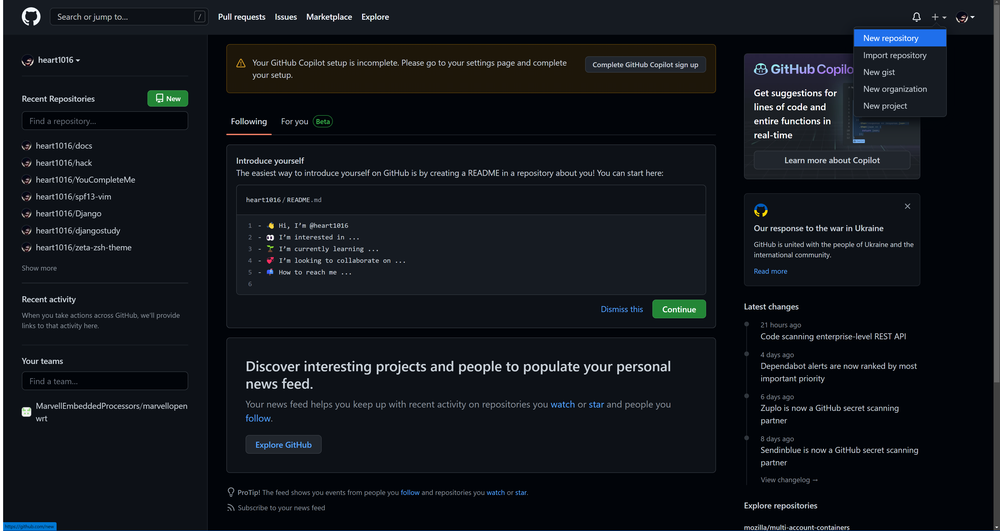
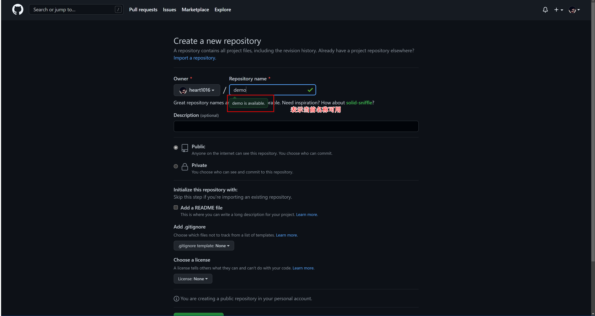
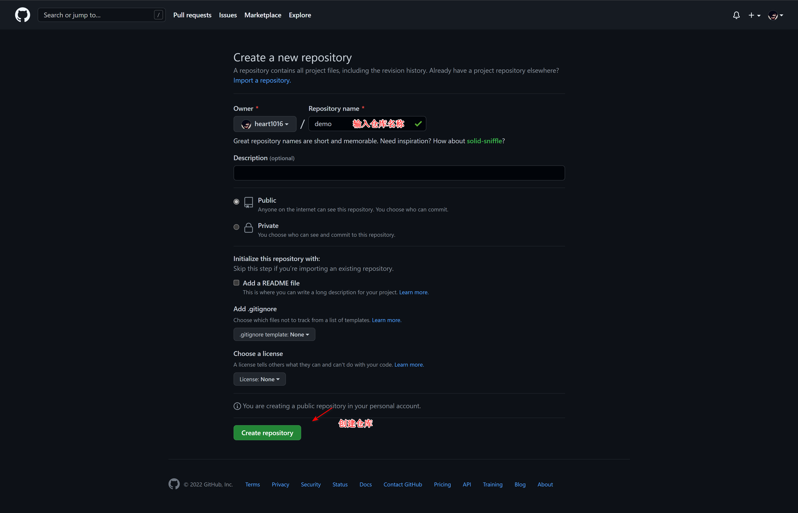
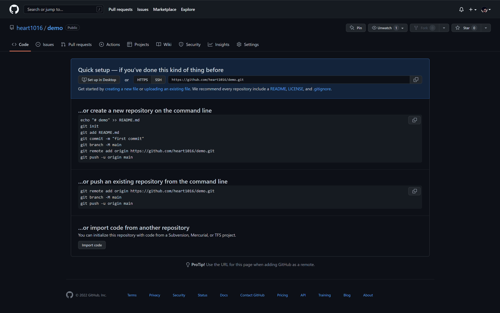
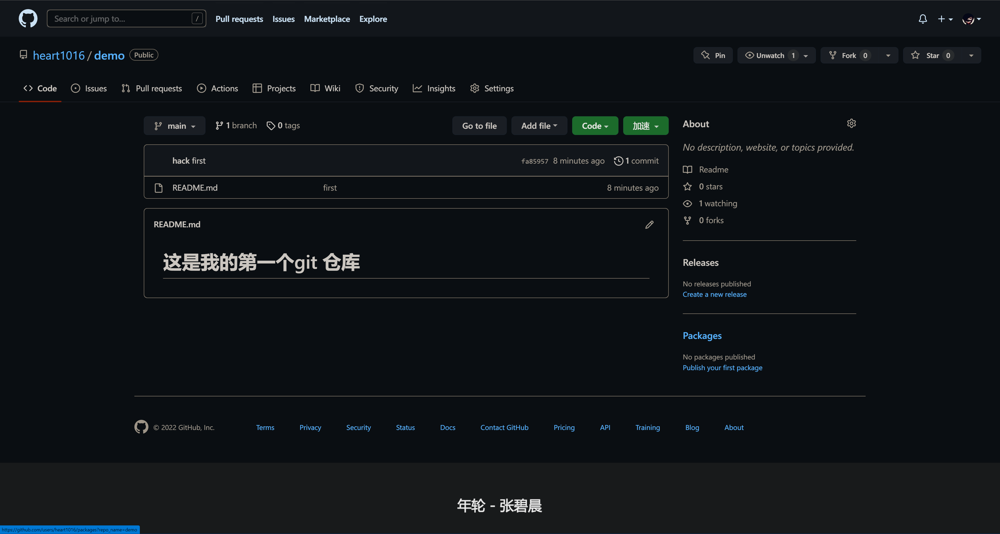

# 基本操作

首先来到 [GitHub](https://github.com/) 网站注册账号 国内无法访问可以用 [Gitee](https://gitee.com/)

这里以 `GitHub` 为例









经过上面的步骤 就已经创建好了一个仓库
有两种方法推送 一是直接在本地初始化一个仓库 推送到对应的地址上 二是直接克隆已经创建好的仓库地址 进行推送
## 初始化 (init)
git init 命令用于在目录中创建新的 Git 仓库

在目录中执行 git init 就可以创建一个 Git 仓库了
```bash
ζ mkdir demo1
# hack@hack: ~                                                                                                                  (22:41:32)
ζ cd demo1
# hack@hack: ~/demo1                                                                                                            (22:41:39)
ζ ls
# hack@hack: ~/demo1                                                                                                            (22:41:40)
ζ la
总用量 0
# hack@hack: ~/demo1                                                                                                            (22:41:42)
ζ git init
提示：使用 'master' 作为初始分支的名称。这个默认分支名称可能会更改。要在新仓库中
提示：配置使用初始分支名，并消除这条警告，请执行：
提示：
提示：  git config --global init.defaultBranch <名称>
提示：
提示：除了 'master' 之外，通常选定的名字有 'main'、'trunk' 和 'development'。
提示：可以通过以下命令重命名刚创建的分支：
提示：
提示：  git branch -m <name>
已初始化空的 Git 仓库于 /home/hack/demo1/.git/
# hack@hack: ~/demo1 <master ✔ >                                                                                                (22:41:45)
ζ la
总用量 4.0K
drwxr-xr-x 7 hack hack 4.0K  7月 23 22:41 .git
# hack@hack: ~/demo1 <master ✔ >                                                                                                (22:41:49)
ζ
```
此时看到已经创建一个.git 文件夹就表示 已经初始化成功了
之后把云端的仓库地址关联上本地的这个仓库 就可以了
```bash
git remote add origin https://github.com/heart1016/demo.git
```
!> 如果已经克隆了 就不用进行上面的操作了 如果没有克隆可以进行上述操作
## 克隆 (clone)
git clone 拷贝一个 Git 仓库到本地 让自己能够查看该项目 或者进行修改
```bash
git clone [url] # url 是你要克隆的仓库地址
git clone -b[分支名] [url] # 克隆指定分支
```
首先把仓库地址复制下来 `https://github.com/heart1016/demo.git`
```bash
 ________________________________________________
/ グランドエスケープ:                      \
\ “めまぐるしい景色の中,君だけが止まって見えた.” /
 ------------------------------------------------
        \   ^__^
         \  (oo)\_______
            (__)\       )\/\
                ||----w |
                ||     ||
# hack@hack: ~                                                                                                                  (19:01:42)
ζ git clone https://github.com/heart1016/demo.git
正克隆到 'demo'...
warning: 您似乎克隆了一个空仓库。
# hack@hack: ~                                                                                                                  (19:02:02)
ζ ls
demo  docs  soul1.json  soul.sql  soul.sql:Zone.Identifier
# hack@hack: ~                                                                                                                  (19:02:08)
ζ
```

在本地看到了demo 文件夹 就说明已经 **克隆(clone)** 下来了

进入demo上传一个文件
```bash
# hack@hack: ~                                                                                                                  (19:02:08)
ζ cd demo
# hack@hack: ~/demo <main ✔ >                                                                                                   (19:06:24)
ζ ls
# hack@hack: ~/demo <main ✔ >                                                                                                   (19:06:26)
ζ la
总用量 4.0K
drwxr-xr-x 7 hack hack 4.0K  7月 23 19:02 .git
# hack@hack: ~/demo <main ✔ >                                                                                                   (19:06:28)
ζ
```
当用ls看到一个文件没有 但是有la 看到了一个文件夹 `.git` 看到前面的点了吗 这个文件夹是个隐藏的 是git的配置文件 这个放在后面讲

创建一个README.md 文件 可以用echo  touch vi  等等
```bash
# hack@hack: ~/demo <main ✔ >                                                                                                   (19:10:38)
ζ echo "# 这是我的第一个git 仓库" > README.md
# hack@hack: ~/demo <main ✘ [?]>                                                                                                (19:11:33)
ζ ls
README.md
# hack@hack: ~/demo <main ✘ [?]>                                                                                                (19:11:35)
ζ cat README.md
# 这是我的第一个git 仓库
# hack@hack: ~/demo <main ✘ [?]>                                                                                                (19:11:41)
ζ
```
此时文件有了 可以用 `git status`   查看下当前仓库的状态

## 状态 (status)
git status 命令用于查看在你上次提交之后是否有对文件进行再次修改
通常我们使用 -s 参数来获得简短的输出结果
```bash
# hack@hack: ~/demo <main ✘ [*]>                                                                                                (22:25:48)
ζ git status -s                                                                                                                  [fa85957]
 M README.md
# hack@hack: ~/demo <main ✘ [*]>                                                                                                (22:25:51)
ζ git status
位于分支 main

尚无提交

未跟踪的文件:
  （使用 "git add <文件>..." 以包含要提交的内容）
        README.md

提交为空，但是存在尚未跟踪的文件（使用 "git add" 建立跟踪）
# hack@hack: ~/demo <main ✘ [?]>                                                                                                (19:18:54)
ζ
```

可以看到文件是红色的 结合git 给的提示 证明现在这个文件还没有在版本控制里 接下来 就把这个文件加入到版本控制

## 添加 (add)
git add 命令可将该文件添加到暂存区

```bash
git add [file1] [file2] [dir] ... # 添加一个或多个文件 或文件夹到暂存区
git add . # 添加当前目录下的所有文件到暂存区
```
```bash
# hack@hack: ~/demo <main ✘ [?]>                                                                                                (19:21:35)
ζ git add README.md
# hack@hack: ~/demo <main ✘ [+]>                                                                                                (19:21:40)
ζ git status
位于分支 main

尚无提交

要提交的变更：
  （使用 "git rm --cached <文件>..." 以取消暂存）
        新文件：   README.md </p>

# hack@hack: ~/demo <main ✘ [+]>                                                                                                (19:21:44)
ζ
```
此时文件变成了绿色 表示文件已经提交到暂存区了

## 提交 (commit)
git commit 命令将暂存区内容添加到本地仓库中

```bash
git commit -m [message] # -m 此次提交的备注信息
git commit -a #  只提交已在版本库中的修改
git commit --amend  #修改最后一次提交的信息
```

```bash
# hack@hack: ~/demo <main ✘ [+]>                                                                                                (22:03:56)
ζ git commit -m "first"
[main （根提交） fa85957] first
 Committer: hack <hack@hack.localdomain>
您的姓名和邮件地址基于登录名和主机名进行了自动设置。请检查它们正确
与否。您可以对其进行设置以免再出现本提示信息：

    git config --global user.name "Your Name"
    git config --global user.email you@example.com

设置完毕后，您可以用下面的命令来修正本次提交所使用的用户身份：

    git commit --amend --reset-author

 1 file changed, 1 insertion(+)
 create mode 100644 README.md
# hack@hack: ~/demo <main ✔ >                                                                                                   (22:04:22)
ζ
```

```bash
#　此时已经提交成功`-m` 是提交的备注信息 可以用`git status` 查看下文件的状态

# hack@hack: ~/demo <main ✔ >                                                                                                   (22:05:26)
ζ git status .                                                                                                                   [fa85957]
位于分支 main
您的分支基于 'origin/main'，但此上游分支已经不存在。
  （使用 "git branch --unset-upstream" 来修复）

无文件要提交，干净的工作区
# hack@hack: ~/demo <main ✔ >                                                                                                   (22:05:30)
ζ
```

```bash
# 接下来 演示-a 的使用方法 创建一个test.md 文件 对README.md 进行了修改 执行commit -a 看看会发生什么
ζ ls                                                                                                                             [9391489]
README.md  test.md

# hack@hack: ~/demo <main ✘ [*?]>                                                                                               (21:17:53)
ζ git status .                                                                                                                   [9391489]
位于分支 main
您的分支与上游分支 'origin/main' 一致。

尚未暂存以备提交的变更：
  （使用 "git add <文件>..." 更新要提交的内容）
  （使用 "git restore <文件>..." 丢弃工作区的改动）
        修改：     README.md

未跟踪的文件:
  （使用 "git add <文件>..." 以包含要提交的内容）
        test.md

修改尚未加入提交（使用 "git add" 和/或 "git commit -a"）

# hack@hack: ~/demo <main ✘ [*?]>                                                                                               (21:17:56)
ζ git commit -am "add test.md"                                                                                                   [9391489]
[main 687f3ef] add test.md
 Committer: hack <hack@hack.localdomain>
您的姓名和邮件地址基于登录名和主机名进行了自动设置。请检查它们正确
与否。您可以对其进行设置以免再出现本提示信息：

    git config --global user.name "Your Name"
    git config --global user.email you@example.com

设置完毕后，您可以用下面的命令来修正本次提交所使用的用户身份：

    git commit --amend --reset-author

 1 file changed, 1 deletion(-)

# hack@hack: ~/demo <main ✘ [?]>                                                                                                (21:21:05)
ζ git status .                                                                                                                   [687f3ef]
位于分支 main
您的分支领先 'origin/main' 共 1 个提交。
  （使用 "git push" 来发布您的本地提交）

未跟踪的文件:
  （使用 "git add <文件>..." 以包含要提交的内容）
        test.md

提交为空，但是存在尚未跟踪的文件（使用 "git add" 建立跟踪）
# hack@hack: ~/demo <main ✘ [?]>                                                                                                (21:21:12)
ζ

# 此时已经成功提交到本地了  但是test.md 并没有提交
```
```bash

# git commit --amend 可以修改最后一次提交的信息 如果不小心提交了错误的信息可以用这个命令修改
  GNU nano 6.2                                         /home/hack/demo/.git/COMMIT_EDITMSG *                                           L
add test.md 123

# 请为您的变更输入提交说明。以 '#' 开始的行将被忽略，而一个空的提交
# 说明将会终止提交。
#
# 日期：  Sun Jul 24 21:21:05 2022 +0800
# 提交者：hack <hack@hack.localdomain>
#
# 位于分支 main
# 您的分支领先 'origin/main' 共 1 个提交。
#   （使用 "git push" 来发布您的本地提交）
#
# 要提交的变更：
#       修改：     README.md
                                                        [ 为过长行强制换行 已启用 ]
^G 帮助        ^O 写入        ^W 搜索        ^K 剪切        ^T 执行命令    ^C 位置        M-U 撤销       M-A 设置标记   M-] 至括号
^X 离开        ^R 读档        ^\ 替换        ^U 粘贴        ^J 对齐        ^/ 跳行        M-E 重做       M-6 复制       ^Q 向前搜索
```


## 推送 (push)
git push 命令用于从将本地的分支版本上传到远程并合并
```bash
git push <远程主机名> <本地分支名>:<远程分支名> # 默认git push 是推送到当前分支上
git push <远程主机名> <本地分支名> # 如果本地分支名与远程分支名相同，则可以省略冒号：
```
此时的文件只是提交到了本地成功了  还并没有提交到云端

```bash
ζ git push                                                                                                                       [fa85957]
枚举对象中: 3, 完成.
对象计数中: 100% (3/3), 完成.
写入对象中: 100% (3/3), 240 字节 | 240.00 KiB/s, 完成.
总共 3（差异 0），复用 0（差异 0），包复用 0
To https://github.com/heart1016/demo.git
 * [new branch]      main -> main
# hack@hack: ~/demo <main ✔ >                                                                                                   (22:10:45)
ζ
```

这样就推送到云端 可以去网页上查看一下


## 拉取 (pull)
当多个人在同一分支上开发时 别人提交了代码 你就可以用这个命令更新下来
```bash
git pull # 默认拉取当前分支
git fetch --all # 强制拉取覆盖
```
```bash
# hack@hack: ~/demo <main ✔ >                                                                                                   (18:32:31)
ζ git pull                                                                                                                       [fa85957]
已经是最新的。
```
因为这个代码没有其它人上传 所以现在是最新的状态

## 更新 (fetch)
这个命令的作用和pull 很像 作用也差不多 区别就是 pull  是直接更新远端的代码到本地 并与本地的修改合并 而fetch 是分成了两步 fetch 更新 merge 合并 这个时候 与 pull 是等价的
当前 文件是这个样子 我去网页上改下 再执行fetch
```bash
ζ ls                                                                                                                             [66d61bb]
README.md
# hack@hack: ~/demo <main ✔ >                                                                                                   (19:31:53)
ζ cat README.md                                                                                                                  [66d61bb]
# 这是我的第一个git 仓库
123
456
789

# hack@hack: ~/demo <main ✔ >                                                                                                   (19:33:41)
ζ git fetch                                                                                                                      [66d61bb]
remote: Enumerating objects: 5, done.
remote: Counting objects: 100% (5/5), done.
remote: Compressing objects: 100% (2/2), done.
remote: Total 3 (delta 0), reused 0 (delta 0), pack-reused 0
展开对象中: 100% (3/3), 691 字节 | 691.00 KiB/s, 完成.
来自 https://github.com/heart1016/demo
   66d61bb..ecb311c  main       -> origin/main
# hack@hack: ~/demo <main ✔ >                                                                                                   (19:33:45)
ζ cat README.md                                                                                                                  [66d61bb]
# 这是我的第一个git 仓库
123
456
789
# hack@hack: ~/demo <main ✔ >                                                                                                   (19:33:50)
ζ git merge                                                                                                                      [66d61bb]
更新 66d61bb..ecb311c
Fast-forward
 README.md | 1 +
 1 file changed, 1 insertion(+)
# hack@hack: ~/demo <main ✔ >                                                                                                   (19:33:58)
ζ cat README.md                                                                                                                  [ecb311c]
# 这是我的第一个git 仓库
123
456
789
000
```

当执行了fetch  之后 看文件并没有 000 这个 只是单纯的更新 merge  之后 本地与云端文件合并 这个时候就有了000
接下来看一下 如果你在修改这个文件 并且这个文件更新 与之冲突

```bash
# hack@hack: ~/demo <main ✔ >                                                                                                   (19:34:01)
ζ git diff
diff --git a/README.md b/README.md
index 05df009..5fdf93b 100644
--- a/README.md
+++ b/README.md
@@ -3,3 +3,4 @@
 456
 789
 000
+888

# 加了888 在本地 线上加了999 接下来更新 更新之前需要把本地的修改储存起来
# hack@hack: ~/demo <main ✔ >                                                                                                   (19:39:36)
ζ git stash                                                                                                                      [ecb311c]
保存工作目录和索引状态 WIP on main: ecb311c Update README.md

# hack@hack: ~/demo <main ✔ >                                                                                                   (19:39:36)
ζ git status .                                                                                                                   [ecb311c]
位于分支 main
您的分支与上游分支 'origin/main' 一致。

无文件要提交，干净的工作区

# 此时的状态就恢复到了最新的样子 你的修改并没有丢失 可以用git stash list 查看
# hack@hack: ~/demo <main ✔ >                                                                                                   (19:39:54)
ζ git stash list
stash@{0}: WIP on main: ecb311c Update README.md
ζ git fetch                                                                                                                      [ecb311c]
remote: Enumerating objects: 5, done.
remote: Counting objects: 100% (5/5), done.
remote: Compressing objects: 100% (2/2), done.
remote: Total 3 (delta 0), reused 0 (delta 0), pack-reused 0
展开对象中: 100% (3/3), 697 字节 | 697.00 KiB/s, 完成.
来自 https://github.com/heart1016/demo
   ecb311c..c31b62f  main       -> origin/main

# hack@hack: ~/demo <main ✔ >                                                                                                   (19:41:25)
ζ git merge                                                                                                                      [ecb311c]
更新 ecb311c..c31b62f
Fast-forward
 README.md | 1 +
 1 file changed, 1 insertion(+)

# hack@hack: ~/demo <main ✔ >                                                                                                   (19:41:34)
ζ git stash pop                                                                                                                  [c31b62f]
自动合并 README.md
冲突（内容）：合并冲突于 README.md
贮藏条目被保留以备您再次需要。

# hack@hack: ~/demo <main ✘ [=]>                                                                                                (19:41:41)
ζ git status .                                                                                                                   [c31b62f]
位于分支 main
您的分支与上游分支 'origin/main' 一致。

未合并的路径：
  （使用 "git restore --staged <文件>..." 以取消暂存）
  （使用 "git add <文件>..." 标记解决方案）
        双方修改：   README.md

修改尚未加入提交（使用 "git add" 和/或 "git commit -a"）
# 此时提示文件冲突 打开文件解决冲突

# hack@hack: ~/demo <main ✘ [=]>                                                                                                (19:42:49)
ζ cat README.md                                                                                                                  [c31b62f]
# 这是我的第一个git 仓库
123
456
789
000
'<<<<<<< Updated upstream'
999
=======
888
'>>>>>>> Stashed changes'

# 选择要保留的 并删除不想要的 我把888 和 999 都保留 重新提交

ζ cat README.md                                                                                                                  [c31b62f]
# 这是我的第一个git 仓库
123
456
789
000
999
888
# hack@hack: ~/demo <main ✘ [=]>                                                                                                (19:46:38)
ζ
```

## 日志 (log)
Git 提交历史一般常用两个命令
```bash
git log # 查看历史提交记录
git blame <file> # 以列表形式查看指定文件的历史修改记录
git log -n 3 # 该选项通常用于限制输出 这个命令只显示该项目的最后3次提交
git log --oneline # 每行一个输出 SHA的前七个字符和提交信息
git log --stat # 日志命令显示被修改的文件 它还显示行数和已更新的总记录的摘要行
git log -p # 显示被修改的文件 它还显示添加 删除和更新的行的位置
git log --graph # 以图表形式查看日志
git log --after="yy-mm-dd" or --before #通过日期和时间来过滤输出
git log --author="Author name" # 按特定用户过滤提交
git log --grep=" Commit message."# 通过提交信息来过滤提交内容
```
在使用 Git 提交了若干更新之后 又或者克隆了某个项目 想回顾下提交历史 我们可以使用 git log 命令查看
```bash
# hack@hack: ~/demo <test ✘ [?]>                                                                                                          (23:13:30)
ζ git log
commit fa85957ecda67e9feb304b417add361df16a1ef8 (HEAD -> main)
Author: hack <hack@hack.localdomain>
Date:   Sat Jul 23 22:04:22 2022 +0800

    first

# hack@hack: ~/demo <test ✘ [?]>                                                                                                          (23:13:30)
ζ git blame README.md
^fa85957 (hack              2022-07-23 22:04:22 +0800 1) # 这是我的第一个git 仓库
00000000 (Not Committed Yet 2022-07-23 23:06:33 +0800 2) 12

# hack@hack: ~/demo <test ✘ [?]>                                                                                                          (23:13:30)
ζ git log --oneline
da20311 (HEAD -> test, main) add test.md
9391489 (origin/main) first
c31b62f Update README.md
ecb311c Update README.md
66d61bb first
0de9caa Update README.md
d25c43e Update README.md
fa85957 first

# hack@hack: ~/demo <test ✘ [?]>                                                                                                          (23:13:30)
ζ git log --stat
commit da203118cfc5481badca69e872f8871f4f100c73 (HEAD -> test, main)
Author: hack <hack@hack.localdomain>
Date:   Sun Jul 24 21:21:05 2022 +0800

    add test.md

 README.md | 1 -
 1 file changed, 1 deletion(-)

commit 9391489f52635557de32038e120670512fa69ccb (origin/main)
Author: hack <hack@hack.localdomain>
Date:   Sun Jul 24 19:49:00 2022 +0800

    first


# hack@hack: ~/demo <test ✘ [?]>                                                                                                          (23:13:30)
ζ git log -p
commit da203118cfc5481badca69e872f8871f4f100c73
Author: hack <hack@hack.localdomain>
Date:   Sun Jul 24 21:21:05 2022 +0800

    add test.md

diff --git a/README.md b/README.md
index 6f888d9..f4b2f13 100644
--- a/README.md
+++ b/README.md
@@ -4,4 +4,3 @@
 789
 000
 999
-888

commit 9391489f52635557de32038e120670512fa69ccb
Author: hack <hack@hack.localdomain>
Date:   Sun Jul 24 19:49:00 2022 +0800

    first

diff --git a/README.md b/README.md
index f4b2f13..6f888d9 100644
--- a/README.md
+++ b/README.md
@@ -4,3 +4,4 @@
 789
 000
 999
+888

commit c31b62f6789cdfdd790b6eb356a8714494b07837
Author: 寂寞奔跑 <heart10162115@foxmail.com>
Date:   Sun Jul 24 19:37:18 2022 +0800

    Update README.md

diff --git a/README.md b/README.md
index 05df009..f4b2f13 100644
--- a/README.md
+++ b/README.md
@@ -3,3 +3,4 @@
 456
 789
 000
+999

```

## 检出 (checkout)
可以恢复文件到此次最新状态 或是 用于分支切换和创建 这个后面讲
```bash
git checkout . # 恢复当前路径下的所有改动文件到此次最新
git checkout [file] [dir] [path] # 可以是一个或多个文件 或是文件夹 或路径都可以
git checkout -b [分支名] # 创建分支并切换到此分支
# hack@hack: ~/demo <main ✘ [*]>                                                                                                (18:29:34)
ζ git status .                                                                                                                   [fa85957]
位于分支 main
您的分支与上游分支 'origin/main' 一致。

尚未暂存以备提交的变更：
  （使用 "git add <文件>..." 更新要提交的内容）
  （使用 "git restore <文件>..." 丢弃工作区的改动）
        修改：     README.md

修改尚未加入提交（使用 "git add" 和/或 "git commit -a"）
# hack@hack: ~/demo <main ✘ [*]>                                                                                                (18:29:43)
ζ cat README.md                                                                                                                  [fa85957]
# 这是我的第一个git 仓库
12
# hack@hack: ~/demo <main ✘ [*]>                                                                                                (18:29:50)
ζ git checkout .                                                                                                                 [fa85957]
从索引区更新了 1 个路径
# hack@hack: ~/demo <main ✔ >                                                                                                   (18:29:56)
ζ git status .                                                                                                                   [fa85957]
位于分支 main
您的分支与上游分支 'origin/main' 一致。

无文件要提交，干净的工作区
# hack@hack: ~/demo <main ✔ >                                                                                                   (18:30:00)
ζ cat README.md                                                                                                                  [fa85957]
# 这是我的第一个git 仓库
# hack@hack: ~/demo <main ✔ >                                                                                                   (18:30:06)
ζ

 git checkout -b test                                                                                                                     [da20311]
切换到一个新分支 'test'
# hack@hack: ~/demo <test ✘ [?]>                                                                                                          (21:54:28)
ζ git branch                                                                                                                               [da20311]
# hack@hack: ~/demo <test ✘ [?]>                                                                                                          (21:54:36)
ζ
  main
* test
```

## 比较 (diff)

比较当前文件与版本库文件的差异

```bash
git diff [file] [path] # 默认不加文件名 是所有差异  可以比较单个文件 或路径
ζ git diff .
diff --git a/README.md b/README.md
index 960abd4..e81e258 100644
--- a/README.md
+++ b/README.md
@@ -1 +1,2 @@
 # 这是我的第一个git 仓库
+123
(END)
```

## 储存 (stash)

开发过程中经常会遇难功能还没有开发完 需要解决其它bug 可能是当前分支 也可能是其它分支 这时候这个就有用处了 未开发完的肯定是不建议提交的 所以这个命令可以把你的修改存储起来 并将代码恢复到本次最新状态

```bash
git stash  # 存储当前所有修改  并恢复到最新
git stash save "message" # 指定存储信息
git stash pop # 取出一个 默认是最后一个 下标0 pop 可以跟上 stash@{0} 指定下标
git stash list # 列表查看
git stash show # 查个修改变化 -p显示变化的具体内容
git stash apply # 与pop类似 但并不像pop 取出后删除存储 默认下标0
git stash drop # 删除一个存储 默认下标0 可以指定下标
git stash clear # 清空存储
git stash branch [分支名] # 把修改存储到一个新的分支上
```

```bash
# hack@hack: ~/demo <main ✘ [*?]>                                                                                                         (23:00:12)
ζ git status .                                                                                                                             [da20311]
位于分支 main
您的分支领先 'origin/main' 共 1 个提交。
  （使用 "git push" 来发布您的本地提交）

尚未暂存以备提交的变更：
  （使用 "git add <文件>..." 更新要提交的内容）
  （使用 "git restore <文件>..." 丢弃工作区的改动）
        修改：     README.md

未跟踪的文件:
  （使用 "git add <文件>..." 以包含要提交的内容）
        file
        test.md

修改尚未加入提交（使用 "git add" 和/或 "git commit -a"）
# hack@hack: ~/demo <main ✘ [*?]>                                                                                                         (23:00:21)
ζ git stash                                                                                                                                [da20311]
保存工作目录和索引状态 WIP on main: da20311 add test.md
# hack@hack: ~/demo <main ✘ [?]>                                                                                                          (23:00:24)
ζ git status .                                                                                                                             [da20311]
位于分支 main
您的分支领先 'origin/main' 共 1 个提交。
  （使用 "git push" 来发布您的本地提交）

未跟踪的文件:
  （使用 "git add <文件>..." 以包含要提交的内容）
        file
        test.md

提交为空，但是存在尚未跟踪的文件（使用 "git add" 建立跟踪）
# hack@hack: ~/demo <main ✘ [?]>                                                                                                          (23:00:27)
ζ git stash list
stash@{0}: WIP on main: da20311 add test.md


# hack@hack: ~/demo <main ✘ [?]>                                                                                                          (23:01:20)
ζ git stash pop                                                                                                                            [da20311]
位于分支 main
您的分支领先 'origin/main' 共 1 个提交。
  （使用 "git push" 来发布您的本地提交）

尚未暂存以备提交的变更：
  （使用 "git add <文件>..." 更新要提交的内容）
ζ git stash save "hello world"                                                                                                             [da20311]
保存工作目录和索引状态 On main: hello world
# hack@hack: ~/demo <main ✘ [?]>                                                                                                          (23:01:59)
ζ git stash list
stash@{0}: On main: hello world

ζ git status .                                                                                                                             [da20311]
位于分支 main
您的分支领先 'origin/main' 共 1 个提交。
  （使用 "git push" 来发布您的本地提交）

未跟踪的文件:
  （使用 "git add <文件>..." 以包含要提交的内容）
        file
        test.md

提交为空，但是存在尚未跟踪的文件（使用 "git add" 建立跟踪）
# hack@hack: ~/demo <main ✘ [?]>                                                                                                          (23:02:48)
ζ git stash pop                                                                                                                            [da20311]
位于分支 main
您的分支领先 'origin/main' 共 1 个提交。
  （使用 "git push" 来发布您的本地提交）

尚未暂存以备提交的变更：
  （使用 "git add <文件>..." 更新要提交的内容）
  （使用 "git restore <文件>..." 丢弃工作区的改动）
        修改：     README.md

未跟踪的文件:
  （使用 "git add <文件>..." 以包含要提交的内容）
        file
        test.md

修改尚未加入提交（使用 "git add" 和/或 "git commit -a"）
丢弃了 refs/stash@{0}（bfc04fcbecd8c0609582e7b3104381ed215e5890）
# hack@hack: ~/demo <main ✘ [*?]>                                                                                                         (23:02:51)
ζ
```

## 重置 (reset)
 重置版本 默认重置到最新的提交 也可以重置到指定版本
```bash
# hack@hack: ~/demo <main ✘ [?]>                                                                                                          (23:20:45)
ζ git status                                                                                                                             [da20311]
位于分支 main
您的分支领先 'origin/main' 共 1 个提交。
  （使用 "git push" 来发布您的本地提交）

尚未暂存以备提交的变更：
  （使用 "git add <文件>..." 更新要提交的内容）
  （使用 "git restore <文件>..." 丢弃工作区的改动）
        修改：     README.md

未跟踪的文件:
  （使用 "git add <文件>..." 以包含要提交的内容）
        file
        test.md


ζ git reset                                                                                                                                [da20311]
重置后取消暂存的变更：
M       README.md

ζ git log
commit da203118cfc5481badca69e872f8871f4f100c73 (HEAD -> hello, test, main)
Author: hack <hack@hack.localdomain>
Date:   Sun Jul 24 21:21:05 2022 +0800

    add test.md

commit 9391489f52635557de32038e120670512fa69ccb (origin/main)
Author: hack <hack@hack.localdomain>
Date:   Sun Jul 24 19:49:00 2022 +0800

    first

commit c31b62f6789cdfdd790b6eb356a8714494b07837
Author: 寂寞奔跑 <heart10162115@foxmail.com>
Date:   Sun Jul 24 19:37:18 2022 +0800

ζ git reset fa85957ecda67e9feb304b417add361df16a1ef8

commit fa85957ecda67e9feb304b417add361df16a1ef8 (HEAD -> main, hello)
Author: hack <hack@hack.localdomain>
Date:   Sat Jul 23 22:04:22 2022 +0800

    first
```