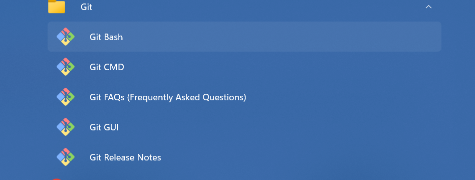

# 安装与配置

> Linux

这里以 `Ubuntu 22.04 LTS` 为例

```bash
# hack@hack: ~                                                                                                                        (23:22:18)
ζ sudo apt install git
正在读取软件包列表... 完成
正在分析软件包的依赖关系树... 完成
正在读取状态信息... 完成
建议安装：
  git-daemon-run | git-daemon-sysvinit git-doc git-email git-gui gitk gitweb git-cvs git-mediawiki git-svn
下列【新】软件包将被安装：
  git
升级了 0 个软件包，新安装了 1 个软件包，要卸载 0 个软件包，有 0 个软件包未被升级。
需要下载 3,131 kB 的归档。
解压缩后会消耗 18.8 MB 的额外空间。
获取:1 http://archive.ubuntu.com/ubuntu jammy-updates/main amd64 git amd64 1:2.34.1-1ubuntu1.4 [3,131 kB]
已下载 3,131 kB，耗时 22秒 (140 kB/s)
正在选中未选择的软件包 git。
(正在读取数据库 ... 系统当前共安装有 64423 个文件和目录。)
准备解压 .../git_1%3a2.34.1-1ubuntu1.4_amd64.deb  ...
正在解压 git (1:2.34.1-1ubuntu1.4) ...
正在设置 git (1:2.34.1-1ubuntu1.4) ...
```

> Windows

这里以 `Windows 11` 为例

[安装网址](https://git-scm.com/)





## 图形化工具

